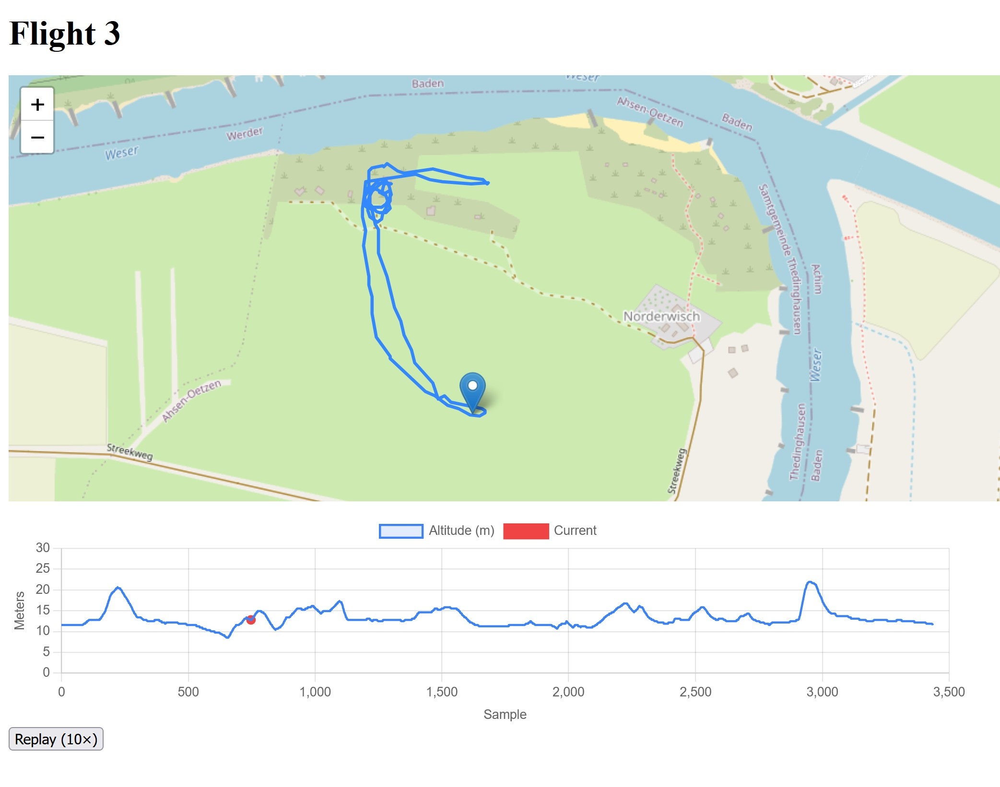

# FlightViewer

FlightViewer is a web application for visualizing DJI drone flight logs in CSV format. It is built with Spring Boot (Java) and Thymeleaf, providing an interactive map and altitude replay for uploaded flights.

## Features
- Upload and visualize DJI flight logs (converted to CSV)
- Interactive map with flight path replay
- Altitude and telemetry data visualization
- REST API for accessing flight and sample data
- Simple, user-friendly web interface

## Getting Started

### Prerequisites
- Java 17 or newer
- Maven

### Setup
1. **Convert your DJI flight log:**
   - Find your `.txt` flight log file on your device under `/FlightRecord`.
   - Convert it to CSV using one of these tools:
     - [PhantomHelp Log Viewer (recommended)](https://www.phantomhelp.com/logviewer/upload/)
     - [AirData Converter](https://app.airdata.com/dji-log-converter)
     - [DJI Assistant/FlightRecordParsingLib](https://github.com/dji-sdk/FlightRecordParsingLib)

2. **Clone and build the project:**
   ```sh
   git clone <your-repo-url>
   cd FlightViewer
   mvn clean package
   ```

3. **Run the application:**
   ```sh
   mvn spring-boot:run
   ```
   Or start from your IDE.

4. **Open your browser:**
   - Go to [http://localhost:8080](http://localhost:8080)
   - Upload a converted CSV log file to view your flight data.

### Demo Data
For testing, you can use the provided demo files:
- `demo flight one.csv`
- `demo flight two.csv`

## Project Structure
```
src/main/java/de/banana/flightviewer/
  controller/    # Web and API controllers
  model/         # JPA entities (Flight, Sample)
  repository/    # Spring Data repositories
  service/       # Business logic (CSV import)
  util/          # Utilities
resources/
  static/js/     # Frontend JavaScript
  templates/     # Thymeleaf HTML templates
```

## Technologies Used
- Java 17+
- Spring Boot
- Spring Data JPA (H2 database by default)
- Thymeleaf
- Apache Commons CSV
- Leaflet.js (for map visualization)

## Example Screenshot


## License
This project is for educational and demonstration purposes.

---

Feel free to contribute or open issues for suggestions!
